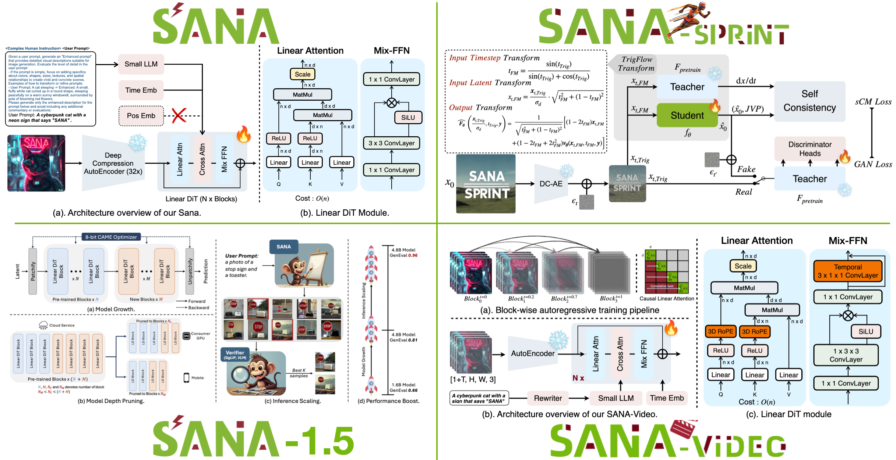
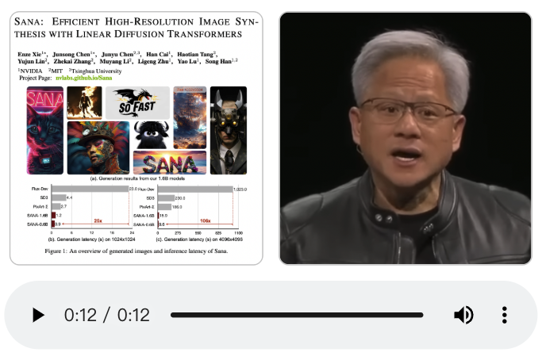

<p align="center" style="border-radius: 10px">
  
</p>

<h3 align="center">
<a href="https://nvlabs.github.io/Sana/docs/"><b>📚 Docs</b></a> | <a href="https://nvlabs.github.io/Sana/"><b>SANA</b></a> | <a href="https://nvlabs.github.io/Sana/Sana-1.5/"><b>SANA-1.5</b></a> | <a href="https://nvlabs.github.io/Sana/Sprint/"><b>SANA-Sprint</b></a> | <a href="https://nvlabs.github.io/Sana/Video/"><b>SANA-Video</b></a> | <a href="https://nv-sana.mit.edu/"><b>Demo</b></a> | <a href="https://huggingface.co/collections/Efficient-Large-Model/sana"><b>🤗 HuggingFace</b></a> | <a href="https://github.com/lawrence-cj/ComfyUI_ExtraModels"><b>ComfyUI</b></a>
</h3>

<p align="center">
  <a href="https://nv-sana.mit.edu/"></a> &ensp;
  <a href="https://nv-sana.mit.edu/4bit/"></a> &ensp;
  <a href="https://nv-sana.mit.edu/ctrlnet/"></a> &ensp;
  <a href="https://nv-sana.mit.edu/sprint/"></a> &ensp;
  <a href="https://huggingface.co/spaces/Efficient-Large-Model/SanaSprint"></a> &ensp;
</p>

<p align="center">
  <a href="https://replicate.com/chenxwh/sana"></a> &ensp;
  <a href="https://discord.gg/rde6eaE5Ta"></a> &ensp;
</p>

<h4 align="center">ICLR 2025 Oral | ICML 2025 | ICCV 2025 Highlight</h4>

**SANA** is an efficiency-oriented codebase for high-resolution image and video generation, providing complete training and inference pipelines. This repository contains code for [SANA](https://nvlabs.github.io/Sana/), [SANA-1.5](https://nvlabs.github.io/Sana/Sana-1.5/), [SANA-Sprint](https://nvlabs.github.io/Sana/Sprint/), and [SANA-Video](https://nvlabs.github.io/Sana/Video/). More details can be found in our [📚 documentation](https://nvlabs.github.io/Sana/docs/).

Join our [Discord](https://discord.gg/rde6eaE5Ta) to engage in discussions with the community! If you have any questions, run into issues, or are interested in contributing, don't hesitate to reach out!

<p align="center" border-radius="10px">
  
</p>

## 🔥🔥 News

- (🔥 New) [2025/12/09] 🎬 [LongSANA](https://nvlabs.github.io/Sana/docs/longsana/): 27FPS real-time minute-length video generation model, training and inference code are all released. Thanks to [LongLive Team](https://github.com/NVlabs/LongLive). Refer to: [[Train]](https://nvlabs.github.io/Sana/docs/longsana/#how-to-train) | [[Test]](https://nvlabs.github.io/Sana/docs/longsana/#how-to-inference) | [[Weight]](https://nvlabs.github.io/Sana/docs/model_zoo/#sana-video)
- (🔥 New) [2025/11/24] 🪶 [Blog](https://hanlab.mit.edu/blog/infinite-context-length-with-global-but-constant-attention-memory): how Causal Linear Attention unlocks infinite context for LLMs and long video generation.
- (🔥 New) [2025/11/9] 🎬 [Introduction video](https://www.youtube.com/watch?v=ztdkfIMkdJ4) shows how Block Causal Linear Attention and Causal Mix-FFN work?
- (🔥 New) [2025/11/6] 📺**SANA-Video** is merged into [diffusers](https://huggingface.co/docs/diffusers/main/en/api/pipelines/sana_video). [How to use](https://nvlabs.github.io/Sana/docs/sana_video/#1-how-to-use-sana-video-pipelines-in-diffusers).
- (🔥 New) [2025/10/27] 📺**SANA-Video** is released. [[README]](https://nvlabs.github.io/Sana/docs/sana_video/) | [[Weights]](https://nvlabs.github.io/Sana/docs/model_zoo/#sana-video) support Text-to-Video, TextImage-to-Video.
- (🔥 New) [2025/10/13] 📺**SANA-Video** is coming, 1). a 5s Linear DiT Video model, and 2). real-time minute-length video generation (with [LongLive](https://github.com/NVlabs/LongLive)). [[paper]](https://www.arxiv.org/pdf/2509.24695) | [[Page]](https://nvlabs.github.io/Sana/Video/)
- (🔥 New) [2025/8/20] We release a new DC-AE-Lite for faster inference and smaller memory. [[How to config]](https://github.com/NVlabs/Sana/blob/main/configs/sana_sprint_config/1024ms/SanaSprint_1600M_1024px_allqknorm_bf16_scm_ladd_dc_ae_lite.yaml#L52) | [[diffusers PR]](https://github.com/huggingface/diffusers/pull/12169) | [[Weight]](https://huggingface.co/mit-han-lab/dc-ae-lite-f32c32-sana-1.1-diffusers)
- (🔥 New) [2025/6/25] [SANA-Sprint](https://nvlabs.github.io/Sana/Sprint/) was accepted to ICCV'25 🏖️
- (🔥 New) [2025/6/4] SANA-Sprint [ComfyUI Node](https://github.com/lawrence-cj/ComfyUI_ExtraModels) is released [[Example]](docs/ComfyUI/SANA-Sprint.json).
- (🔥 New) [2025/5/8] SANA-Sprint (One-step diffusion) diffusers training code is released [[Guidance]](https://github.com/huggingface/diffusers/blob/main/examples/research_projects/sana/README.md).

<details>
  <summary>Click to show all updates</summary>

- (🔥 New) [2025/5/4] **SANA-1.5 (Inference-time scaling) is accepted by ICML-2025.** 🎉🎉🎉
- (🔥 New) [2025/3/22] 🔥**SANA-Sprint demo is hosted on Huggingface, try it!** 🎉 [[Demo Link]](https://huggingface.co/spaces/Efficient-Large-Model/SanaSprint)
- (🔥 New) [2025/3/22] 🔥**SANA-1.5 is supported in ComfyUI!** 🎉: [ComfyUI Guidance](https://nvlabs.github.io/Sana/docs/ComfyUI/comfyui/) | [ComfyUI Work Flow SANA-1.5 4.8B](https://nvlabs.github.io/Sana/docs/ComfyUI/SANA-1.5_FlowEuler.json)
- (🔥 New) [2025/3/22] 🔥**SANA-Sprint code & weights are released!** 🎉 Include: [Training & Inference](https://nvlabs.github.io/Sana/docs/sana_sprint/) code and [Weights](https://nvlabs.github.io/Sana/docs/model_zoo/#sana-sprint) / [HF](https://huggingface.co/collections/Efficient-Large-Model/sana-sprint) are all released. [[Guidance]](https://nvlabs.github.io/Sana/docs/sana_sprint/)
- (🔥 New) [2025/3/21] 🚀Sana + **Inference Scaling** is released. [[Guidance]](https://nvlabs.github.io/Sana/docs/inference_scaling/)
- (🔥 New) [2025/3/16] 🔥**SANA-1.5 code & weights are released!** 🎉 Include: [DDP/FSDP](https://nvlabs.github.io/Sana/docs/sana/#training) | [TAR file WebDataset](https://nvlabs.github.io/Sana/docs/sana/#multi-scale-webdataset) | [Multi-Scale](https://nvlabs.github.io/Sana/docs/sana/#training-with-fsdp) Training code and [Weights](https://nvlabs.github.io/Sana/docs/model_zoo/#sana-15) | [HF](https://huggingface.co/collections/Efficient-Large-Model/sana-15) are all released.
- (🔥 New) [2025/3/14] 🏃**SANA-Sprint is coming out!** 🎉 A new one/few-step generator of Sana. 0.1s per 1024px image on H100, 0.3s on RTX 4090. Find out more details: [[Page]](https://nvlabs.github.io/Sana/Sprint/) | [[Arxiv]](https://arxiv.org/abs/2503.09641). Code is coming very soon along with `diffusers`
- (🔥 New) [2025/2/10] 🚀Sana + ControlNet is released. [[Guidance]](https://nvlabs.github.io/Sana/docs/sana_controlnet/) | [[Model]](https://nvlabs.github.io/Sana/docs/model_zoo/#sana) | [[Demo]](https://nv-sana.mit.edu/ctrlnet/)
- (🔥 New) [2025/1/30] Release CAME-8bit optimizer code. Saving more GPU memory during training. [[How to config]](https://github.com/NVlabs/Sana/blob/main/configs/sana_config/1024ms/Sana_1600M_img1024_CAME8bit.yaml#L86)
- (🔥 New) [2025/1/29] 🎉 🎉 🎉**SANA 1.5 is out! Figure out how to do efficient training & inference scaling!** 🚀[[Tech Report]](https://arxiv.org/abs/2501.18427)
- (🔥 New) [2025/1/24] 4bit-Sana is released, powered by [SVDQuant and Nunchaku](https://github.com/mit-han-lab/nunchaku) inference engine. Now run your Sana within **8GB** GPU VRAM [[Guidance]](https://nvlabs.github.io/Sana/docs/4bit_sana/) [[Demo]](https://svdquant.mit.edu/) [[Model]](https://nvlabs.github.io/Sana/docs/model_zoo/#sana)
- (🔥 New) [2025/1/24] DCAE-1.1 is released, better reconstruction quality. [[Model]](https://huggingface.co/mit-han-lab/dc-ae-f32c32-sana-1.1) [[diffusers]](https://huggingface.co/mit-han-lab/dc-ae-f32c32-sana-1.1-diffusers)
- (🔥 New) [2025/1/23] **Sana is accepted as Oral by ICLR-2025.** 🎉🎉🎉
- (🔥 New) [2025/1/12] DC-AE tiling makes Sana-4K inferences 4096x4096px images within 22GB GPU memory. With model offload and 8bit/4bit quantize. The 4K Sana run within **8GB** GPU VRAM. [[Guidance]](https://nvlabs.github.io/Sana/docs/model_zoo/#3-2k-4k-models)
- (🔥 New) [2025/1/11] Sana code-base license changed to Apache 2.0.
- (🔥 New) [2025/1/10] Inference Sana with 8bit quantization.[[Guidance]](https://nvlabs.github.io/Sana/docs/8bit_sana/#quantization)
- (🔥 New) [2025/1/8] 4K resolution [Sana models](https://nvlabs.github.io/Sana/docs/model_zoo/#sana) is supported in [Sana-ComfyUI](https://github.com/lawrence-cj/ComfyUI_ExtraModels) and [work flow](https://nvlabs.github.io/Sana/docs/ComfyUI/Sana_FlowEuler_4K.json) is also prepared. [[4K guidance]](https://nvlabs.github.io/Sana/docs/ComfyUI/comfyui/#a-sample-workflow-for-sana-4096x4096-image-18gb-gpu-is-needed)
- (🔥 New) [2025/1/8] 1.6B 4K resolution [Sana models](https://nvlabs.github.io/Sana/docs/model_zoo/#sana) are released: [[BF16 pth]](https://huggingface.co/Efficient-Large-Model/Sana_1600M_4Kpx_BF16) or [[BF16 diffusers]](https://huggingface.co/Efficient-Large-Model/Sana_1600M_4Kpx_BF16_diffusers). 🚀 Get your 4096x4096 resolution images within 20 seconds! Find more samples in [Sana page](https://nvlabs.github.io/Sana/). Thanks [SUPIR](https://github.com/Fanghua-Yu/SUPIR) for their wonderful work and support.
- (🔥 New) [2025/1/2] Bug in the `diffusers` pipeline is solved. [Solved PR](https://github.com/huggingface/diffusers/pull/10431)
- (🔥 New) [2025/1/2] 2K resolution [Sana models](asset/docs/model_zoo.md) is supported in [Sana-ComfyUI](https://github.com/lawrence-cj/ComfyUI_ExtraModels) and [work flow](asset/docs/ComfyUI/Sana_FlowEuler_2K.json) is also prepared.
- ✅ [2024/12] 1.6B 2K resolution [Sana models](asset/docs/model_zoo.md) are released: [[BF16 pth]](https://huggingface.co/Efficient-Large-Model/Sana_1600M_2Kpx_BF16) or [[BF16 diffusers]](https://huggingface.co/Efficient-Large-Model/Sana_1600M_2Kpx_BF16_diffusers). 🚀 Get your 2K resolution images within 4 seconds! Find more samples in [Sana page](https://nvlabs.github.io/Sana/). Thanks [SUPIR](https://github.com/Fanghua-Yu/SUPIR) for their wonderful work and support.
- ✅ [2024/12] `diffusers` supports Sana-LoRA fine-tuning! Sana-LoRA's training and convergence speed is super fast. [[Guidance]](https://nvlabs.github.io/Sana/docs/sana_lora_dreambooth/) or [[diffusers docs]](https://github.com/huggingface/diffusers/blob/main/examples/dreambooth/README_sana.md).
- ✅ [2024/12] `diffusers` has Sana! [All Sana models in diffusers safetensors](https://huggingface.co/collections/Efficient-Large-Model/sana) are released and diffusers pipeline `SanaPipeline`, `SanaPAGPipeline`, `DPMSolverMultistepScheduler(with FlowMatching)` are all supported now. We prepare a [Model Card](https://nvlabs.github.io/Sana/docs/model_zoo/#sana) for you to choose.
- ✅ [2024/12] 1.6B BF16 [Sana model](https://huggingface.co/Efficient-Large-Model/Sana_1600M_1024px_BF16) is released for stable fine-tuning.
- ✅ [2024/12] We release the [ComfyUI node](https://github.com/lawrence-cj/ComfyUI_ExtraModels) for Sana. [[Guidance]](https://nvlabs.github.io/Sana/docs/ComfyUI/comfyui/)
- ✅ [2024/11] All multi-linguistic (Emoji & Chinese & English) SFT models are released: [1.6B-512px](https://huggingface.co/Efficient-Large-Model/Sana_1600M_512px_MultiLing), [1.6B-1024px](https://huggingface.co/Efficient-Large-Model/Sana_1600M_1024px_MultiLing), [600M-512px](https://huggingface.co/Efficient-Large-Model/Sana_600M_512px), [600M-1024px](https://huggingface.co/Efficient-Large-Model/Sana_600M_1024px). The metric performance is shown [here](#performance)
- ✅ [2024/11] Sana Replicate API is launching at [Sana-API](https://replicate.com/chenxwh/sana).
- ✅ [2024/11] 1.6B [Sana models](https://huggingface.co/collections/Efficient-Large-Model/sana) are released.
- ✅ [2024/11] Training & Inference & Metrics code are released.
- ✅ [2024/11] Working on [`diffusers`](https://github.com/huggingface/diffusers/pull/9982).
- [2024/10] [Demo](https://nv-sana.mit.edu/) is released.
- [2024/10] [DC-AE Code](https://github.com/mit-han-lab/efficientvit/blob/master/applications/dc_ae/README.md) and [weights](https://huggingface.co/collections/mit-han-lab/dc-ae) are released!
- [2024/10] [Paper](https://arxiv.org/abs/2410.10629) is on Arxiv!

</details>

## 💡 Introduction

We introduce **SANA**, a series of efficient diffusion models for high-resolution image and video generation:

- **[SANA](https://nvlabs.github.io/Sana/)**: Text-to-image generation up to 4K resolution, **20× smaller and 100× faster** than Flux-12B.
- **[SANA-1.5](https://nvlabs.github.io/Sana/Sana-1.5/)**: Efficient training-time and inference-time compute scaling for better quality.
- **[SANA-Sprint](https://nvlabs.github.io/Sana/Sprint/)**: One/few-step generation via sCM distillation, **0.1s per 1024px image** on H100.
  | **[SANA-Video/LongSANA](https://nvlabs.github.io/Sana/Video/)** | Efficient video generation with Block Linear Attention / with [LongLive](https://github.com/NVlabs/LongLive)|

**Key Techniques:**

- **Linear Attention**: Replace vanilla attention in DiT with linear attention for efficiency at high resolutions.
- **[DC-AE](https://hanlab.mit.edu/projects/dc-ae)**: 32× image compression (vs. traditional 8×) to reduce latent tokens.
- **Decoder-only Text Encoder**: Modern decoder-only LLM with in-context learning for better text-image alignment.
- **Block Causal Linear Attention & Causal Mix-FFN**: Efficient attention and feedforward for long video generation.
- **Flow-DPM-Solver**: Reduce sampling steps with efficient training and sampling.
- **sCM Distillation**: One/few-step generation with continuous-time consistency distillation.

**In summary**, SANA is a fully open-source framework integrating **efficient training, fast inference, and flexible deployment** for both image and video generation. Deployable on laptop GPUs with **< 8GB VRAM** via 4-bit quantization.

<p align="center" border-raduis="10px">
  
</p>

## Quick Start

```bash
git clone https://github.com/NVlabs/Sana.git
cd Sana && ./environment_setup.sh sana
```

### Inference with 🧨 diffusers

```python
import torch
from diffusers import SanaPipeline

pipe = SanaPipeline.from_pretrained(
    "Efficient-Large-Model/SANA1.5_1.6B_1024px_diffusers",
    torch_dtype=torch.bfloat16,
)
pipe.to("cuda")

pipe.vae.to(torch.bfloat16)
pipe.text_encoder.to(torch.bfloat16)

prompt = 'a cyberpunk cat with a neon sign that says "Sana"'
image = pipe(
    prompt=prompt,
    height=1024,
    width=1024,
    guidance_scale=4.5,
    num_inference_steps=20,
    generator=torch.Generator(device="cuda").manual_seed(42),
)[0]

image[0].save("sana.png")
```

> [!TIP]
> Upgrade your `diffusers>=0.32.0` to use `SanaPipeline`. More details can be found in [📚 Docs](https://nvlabs.github.io/Sana/docs/).

## Getting Started

- [📚 **Full Documentation**](https://nvlabs.github.io/Sana/docs/)
- [Installation Guide](https://nvlabs.github.io/Sana/docs/installation/)
- [Model Zoo](https://nvlabs.github.io/Sana/docs/model_zoo/)
- [Sana Inference & Training](https://nvlabs.github.io/Sana/docs/sana/)
- [SANA-Sprint](https://nvlabs.github.io/Sana/docs/sana_sprint/)
- [SANA-Video](https://nvlabs.github.io/Sana/docs/sana_video/)
- [LongSANA](https://nvlabs.github.io/Sana/docs/longsana/)
- [ControlNet](https://nvlabs.github.io/Sana/docs/sana_controlnet/)
- [LoRA / DreamBooth](https://nvlabs.github.io/Sana/docs/sana_lora_dreambooth/)
- [Quantization (4bit / 8bit)](https://nvlabs.github.io/Sana/docs/4bit_sana/)
- [ComfyUI](https://nvlabs.github.io/Sana/docs/ComfyUI/comfyui/)

## Performance

### Image Generation (1024px)

| Methods (1024x1024) | Throughput (samples/s) | Latency (s) | Params (B) | Speedup | FID 👇 | CLIP 👆 | GenEval 👆 | DPG 👆 |
|--------------------------------------------------------------------------------------------------|------------------------|-------------|------------|---------|-------------|--------------|-------------|---------------|
| FLUX-dev | 0.04 | 23.0 | 12.0 | 1.0× | 10.15 | 27.47 | 0.67 | 84.0 |
| **Sana-0.6B** | 1.7 | 0.9 | 0.6 | 39.5× | _5.81_ | 28.36 | 0.64 | 83.6 |
| **[Sana-0.6B](https://huggingface.co/Efficient-Large-Model/Sana_600M_1024px)** | 1.7 | 0.9 | 0.6 | 39.5× | **5.61** | 28.80 | 0.68 | _84.2_ |
| **[Sana-1.6B](https://huggingface.co/Efficient-Large-Model/Sana_1600M_1024px_MultiLing)** | 1.0 | 1.2 | 1.6 | 23.3× | 5.92 | _28.94_ | _0.69_ | <u>84.5</u> |
| **[Sana-1.5 1.6B](https://huggingface.co/Efficient-Large-Model/SANA1.5_1.6B_1024px_diffusers)** | 1.0 | 1.2 | 1.6 | 23.3× | <u>5.70</u> | <u>29.12</u> | **0.82** | <u>84.5</u> |
| **[Sana-1.5 4.8B](https://huggingface.co/Efficient-Large-Model/SANA1.5_4.8B_1024px_diffusers)** | 0.26 | 4.2 | 4.8 | 6.5× | 5.99 | **29.23** | <u>0.81</u> | **84.7** |

### Video Generation (VBench 720p)

| Models | Latency (s) | Params (B) | VBench Total ↑ | Quality ↑ | Semantic ↑ |
|--------|-------------|------------|----------------|-----------|------------|
| Wan-2.1-14B | 1897 | 14 | 83.73 | 85.77 | 75.58 |
| Wan-2.1-1.3B | 400 | 1.3 | 83.38 | 85.67 | 74.22 |
| **SANA-Video-2B** | **36** | **2** | **84.05** | 84.63 | **81.73** |

# 💪To-Do List

We will try our best to achieve

- [✅] Training code
- [✅] Inference code
- [✅] Model zoo
- [✅] [ComfyUI Nodes](https://github.com/lawrence-cj/ComfyUI_ExtraModels)(SANA, SANA-1.5,
  SANA-Sprint)
- [✅] DC-AE Diffusers
- [✅] Sana merged in Diffusers(https://github.com/huggingface/diffusers/pull/9982)
- [✅] LoRA training by [@paul](https://github.com/sayakpaul)(`diffusers`: https://github.com/
  huggingface/diffusers/pull/10234)
- [✅] 2K/4K resolution models.(Thanks [@SUPIR](https://github.com/Fanghua-Yu/SUPIR) to
  provide a 4K super-resolution model)
- [✅] 8bit / 4bit Laptop development
- [✅] ControlNet (train & inference & models)
- [✅] FSDP Training
- [✅] SANA-1.5 (Larger model size / Inference Scaling)
- [✅] SANA-Sprint: Few-step generator
- [✅] Faster DCAE-Lite [weight](https://huggingface.co/dc-ai/dc-ae-lite-f32c32-diffusers)
- [✅] Better re-construction F32/F64 [VAEs](https://github.com/dc-ai-projects/DC-Gen).
- [✅] SANA-Video: Linear DiT Video model, and real-time minute-length video generation
- [🚀] See you in the future

## 🤗 Acknowledgements

Thanks to the following open-sourced projects:

**Thanks to the following open-sourced codebase for their wonderful work and codebase!**

- [PixArt-α](https://github.com/PixArt-alpha/PixArt-alpha)
- [PixArt-Σ](https://github.com/PixArt-alpha/PixArt-sigma)
- [diffusers](https://github.com/huggingface/diffusers)
- [Efficient-ViT](https://github.com/mit-han-lab/efficientvit)
- [ComfyUI_ExtraModels](https://github.com/city96/ComfyUI_ExtraModels)
- [SVDQuant and Nunchaku](https://github.com/mit-han-lab/nunchaku)
- [Open-Sora](https://github.com/hpcaitech/Open-Sora)
- [Wan](https://github.com/Wan-Video/Wan2.1)
- [LongLive](https://github.com/NVlabs/LongLive)

Thanks [Paper2Video](https://showlab.github.io/Paper2Video/) for generating Jeason presenting SANA😊. Refer to [Paper2Video](https://showlab.github.io/Paper2Video/) for more details.

<div align="center">
  <a href="https://showlab.github.io/Paper2Video/assets/huang/huang.mp4" target="_blank">
    
  </a>
</div>

## Contribution

Thanks goes to these wonderful contributors:

<a href="https://github.com/NVlabs/Sana/graphs/contributors">
  
</a>

## 🌟 Star History

[](https://www.star-history.com/#NVlabs/sana&Date)

# 📖BibTeX

```
@misc{xie2024sana,
      title={Sana: Efficient High-Resolution Image Synthesis with Linear Diffusion Transformer},
      author={Enze Xie and Junsong Chen and Junyu Chen and Han Cai and Haotian Tang and Yujun Lin and Zhekai Zhang and Muyang Li and Ligeng Zhu and Yao Lu and Song Han},
      year={2024},
      eprint={2410.10629},
      archivePrefix={arXiv},
      primaryClass={cs.CV},
      url={https://arxiv.org/abs/2410.10629},
    }
@misc{xie2025sana,
      title={SANA 1.5: Efficient Scaling of Training-Time and Inference-Time Compute in Linear Diffusion Transformer},
      author={Xie, Enze and Chen, Junsong and Zhao, Yuyang and Yu, Jincheng and Zhu, Ligeng and Lin, Yujun and Zhang, Zhekai and Li, Muyang and Chen, Junyu and Cai, Han and others},
      year={2025},
      eprint={2501.18427},
      archivePrefix={arXiv},
      primaryClass={cs.CV},
      url={https://arxiv.org/abs/2501.18427},
    }
@misc{chen2025sanasprint,
      title={SANA-Sprint: One-Step Diffusion with Continuous-Time Consistency Distillation},
      author={Junsong Chen and Shuchen Xue and Yuyang Zhao and Jincheng Yu and Sayak Paul and Junyu Chen and Han Cai and Song Han and Enze Xie},
      year={2025},
      eprint={2503.09641},
      archivePrefix={arXiv},
      primaryClass={cs.CV},
      url={https://arxiv.org/abs/2503.09641},
    }
@misc{chen2025sana,
      title={SANA-Video: Efficient Video Generation with Block Linear Diffusion Transformer},
      author={Chen, Junsong and Zhao, Yuyang and Yu, Jincheng and Chu, Ruihang and Chen, Junyu and Yang, Shuai and Wang, Xianbang and Pan, Yicheng and Zhou, Daquan and Ling, Huan and others},
      year={2025},
      eprint={2509.24695},
      archivePrefix={arXiv},
      primaryClass={cs.CV},
      url={https://arxiv.org/abs/2509.24695},
    }
```
