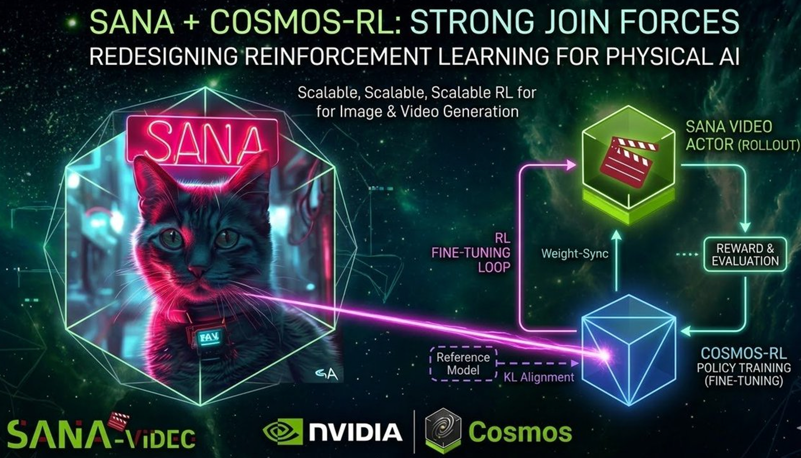

<p align="center" style="border-radius: 10px">
  
</p>

# SANA &times; Cosmos-RL: Post-Training (SFT/RL) for Image & Video Diffusion Models

<div align="center">
  <a href="https://github.com/nvidia-cosmos/cosmos-rl/blob/main/examples/sana.md"></a>
  &nbsp; <a href="https://github.com/nvidia-cosmos/cosmos-rl"></a>
</div>

We have partnered with [Cosmos-RL](https://github.com/nvidia-cosmos/cosmos-rl) to provide a complete RL infrastructure for SANA. This document summarizes how to post-train (SFT/RL) SANA-Image or SANA-Video on Cosmos-RL.

<p align="center" style="border-radius: 10px">
  
</p>

## Overview

**SANA** is an efficiency-oriented codebase for high-resolution image and video generation. **Cosmos-RL** is NVIDIA's flexible and scalable reinforcement learning framework. Together they support:

- **SFT** (Supervised Fine-Tuning): full and LoRA for image and video
- **RL** (e.g. DiffusionNFT & Flow-GRPO): image and video with async reward service and configurable datasets

## Supported Algorithms & Features

Cosmos-RL supports state-of-the-art algorithms including **GRPO**, **DAPO** for LLMs, and for diffusion/world models **FlowGRPO**, **DDRL**, and **DiffusionNFT**. SANA is natively supported. For full details see the [Cosmos-RL documentation](https://nvidia-cosmos.github.io/cosmos-rl/) and the [post-training of diffusion models](https://nvidia-cosmos.github.io/cosmos-rl/wfm/overview.html) overview.

## Configuration

**Configs**: SANA configs live in [`configs/sana`](https://github.com/nvidia-cosmos/cosmos-rl/tree/main/configs/sana). Presets include:

- **SFT** — Image: `sana-image-sft`, `sana-image-sft-lora`; Video: `sana-video-sft`, `sana-video-sft-lora`
- **RL** — Image: `sana-image-nft`; Video: `sana-video-nft`

See the [Configuration Page](https://nvidia-cosmos.github.io/cosmos-rl/quickstart/configuration.html) for argument details.

**Reward service**: Use a separate async reward service; see [reward_service/README.md](https://github.com/nvidia-cosmos/cosmos-rl/tree/main/reward_service/README.md). Set `REMOTE_REWARD_TOKEN`, `REMOTE_REWARD_ENQUEUE_URL`, and `REMOTE_REWARD_FETCH_URL` for the trainer.

## Training

**SFT** (example with image LoRA):

```bash
cosmos-rl --config ./configs/sana/sana-image-sft-lora.toml cosmos_rl.tools.dataset.diffusers_dataset
```

**RL** (image NFT):

```bash
cosmos-rl --config ./configs/sana/sana-image-nft.toml cosmos_rl.tools.dataset.diffusion_nft
```

Datasets: SFT uses local dirs with `*.json` + `*.jpg` / `*.mp4`. RL supports image datasets (e.g. pickscore, ocr, geneval) and video (e.g. filtered VidProM). You can customize via [`cosmos_rl/tools/dataset/diffusion_nft.py`](https://github.com/nvidia-cosmos/cosmos-rl/blob/main/cosmos_rl/tools/dataset/diffusion_nft.py) and the [Customization](https://nvidia-cosmos.github.io/cosmos-rl/quickstart/customization.html) guide.

## Links

- [SANA on Cosmos-RL (examples/sana.md)](https://github.com/nvidia-cosmos/cosmos-rl/blob/main/examples/sana.md)
- [Cosmos-RL docs](https://nvidia-cosmos.github.io/cosmos-rl/)
- [Cosmos-RL GitHub](https://github.com/nvidia-cosmos/cosmos-rl)
